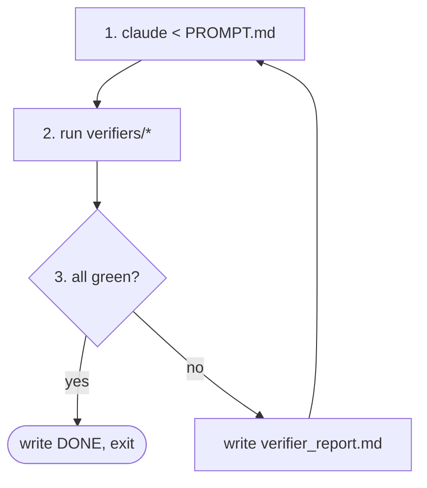

# claude-ralph

A [ralph loop](https://ghuntley.com/ralph/) runner for Claude Code, with **pluggable, externally-verified success criteria**. Drop in a spec, drop in a verifier, run `claude-ralph`, walk away.

> **What's a ralph loop?** `while :; do cat PROMPT.md | claude-code; done`, basically. You hand the agent a goal and a punch list, it iterates, you watch. The hard part isn't the loop — it's knowing when to stop and what "done" actually means. See Huntley's [original](https://ghuntley.com/loop/) and [follow-up](https://ghuntley.com/ralph/).

## Why this exists

The canonical ralph loop has one critical weakness: **"done" is whatever the LLM says it is.** The model writes `DONE` to a sentinel file when it *thinks* it's done. That's a hallucination away from a green light on red code.

`claude-ralph` replaces self-report with **external verifiers** — exit-code-driven scripts that run after every iteration and gate the loop. The agent doesn't decide it's done; your test suite does. Or your typechecker. Or a Playwright script. Or Chrome DevTools MCP eyeballing the rendered page. Or all four.

That's the whole pitch. The tool itself is small, foreground, Unix-y — one process, one loop, ^C to stop. **Sandboxing is your call.** Run it on your laptop, in a devcontainer, in a VM, in a Codespace, behind `firejail` — `claude-ralph` doesn't care. We recommend you don't run unbounded `claude` on a host you'd cry over, but the tool isn't going to hold your hand about it. See [Sandboxing recommendations](#sandboxing-recommendations) below.

## How it works



Each iteration:

1. Compose a prompt from `PROMPT.md` + `specs/` + `fix_plan.md` + the previous iteration's `verifier_report.md`.
2. Pipe it to `claude`. The agent edits files, runs commands, updates `fix_plan.md`.
3. Run every executable in `.ralph/verifiers/` in lexical order. Capture stdout/stderr and exit codes.
4. **All exit 0** → write `.ralph/DONE`, exit cleanly. **Anything nonzero** → write a fresh `verifier_report.md` summarizing failures, loop.

The verifier report is the feedback signal. The agent reads it next iteration and reacts.

## Install

With curl:

```sh
sh -c "$(curl -fsSL https://raw.githubusercontent.com/nbarlow/claude-ralphs/main/install.sh)"
```

Or wget:

```sh
sh -c "$(wget -qO- https://raw.githubusercontent.com/nbarlow/claude-ralphs/main/install.sh)"
```

Works from bash, zsh, fish, dash, or any POSIX shell — the outer `sh -c` spawns its own POSIX shell, so your interactive shell doesn't matter. The installer is POSIX `sh` itself (no bashisms) so it runs on Alpine, BusyBox, and macOS's stock `/bin/sh`.

We use `sh -c "$(... )"` instead of `... | sh` so the script is downloaded **completely** before any of it executes — a flaky connection produces a parse error, not a half-installed system. Same pattern Homebrew and oh-my-zsh use.

What it does:

- Drops `claude-ralph` into `~/.local/bin/` (override with `PREFIX=/usr/local`, will prompt for sudo if needed).
- Detects your login shell (`bash`, `zsh`, `fish`) and prints the exact one-liner to add `~/.local/bin` to `$PATH` if it isn't already. Doesn't edit your rc files without consent.
- Verifies `claude` is on `$PATH` and `ANTHROPIC_API_KEY` is set; warns but doesn't fail if not.

Pin a version with `VERSION=v0.2.0 curl ... | sh`, or run `claude-ralph self-update` later.

### Windows

PowerShell:

```powershell
irm https://raw.githubusercontent.com/nbarlow/claude-ralphs/main/install.ps1 | iex
```

Or use WSL with the POSIX installer above. `claude-ralph` is bash; native Windows isn't a target.

### From source

Clone the repo, then:

```bash
make install                # symlinks bin/claude-ralph into ~/.local/bin (override with PREFIX=...)
```

Other targets: `make test`, `make check`, `make uninstall`, `make help`. `make` is only needed if you're building from source — the installed CLI itself doesn't depend on it.

### Requirements

- The `claude` CLI on `PATH` ([install instructions](https://docs.anthropic.com/en/docs/claude-code/quickstart))
- `ANTHROPIC_API_KEY` in your environment (or whatever auth `claude` is set up for)
- `bash` (you have it)

## Quick start

In any project:

```bash
claude-ralph init           # scaffolds .ralph/ — PROMPT.md, specs/, verifiers/, fix_plan.md
$EDITOR .ralph/PROMPT.md    # state the goal
$EDITOR .ralph/specs/001-*.md
chmod +x .ralph/verifiers/01-tests.sh   # already scaffolded; edit to taste
claude-ralph                # start looping. ^C to stop.
```

It's a foreground process. Background it with `&`, `nohup`, `tmux`, `systemd-run --user`, or whatever you'd reach for normally. Tail per-iteration logs with `tail -f .ralph/iterations/*/stdout.log`.

## The `.ralph/` layout

| path | written by | purpose |
|---|---|---|
| `PROMPT.md` | you | The prompt fed to claude every iteration. Tune it. |
| `AGENT.md` | agent | How-to-build, how-to-run, learnings. Agent appends. |
| `fix_plan.md` | agent | Prioritized punch list. Agent maintains. |
| `specs/NNN-*.md` | you | What to build. One file per slice. |
| `verifiers/NN-*.sh` | you | Success criteria. Exit 0 = pass. Lexical run order. |
| `verifier_report.md` | ralph | Last run's results. Read by the agent next iteration. |
| `iterations/NNNN/` | ralph | Full history per iteration: `prompt.txt`, `stdout.log`, `stderr.log`, `verifiers.json`. |
| `config.toml` | you | Loop / claude knobs. Optional. |
| `DONE` | ralph | Sentinel — written when all verifiers pass. Loop exits. |

## Verifiers: the plugin contract

**The contract is exit code + stdout.** That's it. No YAML, no plugin registry, no DSL.

A verifier is any executable in `.ralph/verifiers/`. It:

- Runs from the workspace root, in the same environment as the agent.
- Exits **0** if its criterion is satisfied, **nonzero** otherwise.
- Writes human-readable diagnostic output to stdout/stderr — this gets fed back to the agent.

Naming: lexical order = run order. Use `NN-name` (`01-tests.sh`, `02-lint.sh`) so you control sequencing.

### Examples

**Tests pass:**

```bash
#!/usr/bin/env bash
# .ralph/verifiers/01-tests.sh
set -euo pipefail
npm test
```

**Typecheck clean:**

```bash
#!/usr/bin/env bash
# .ralph/verifiers/02-typecheck.sh
set -euo pipefail
npx tsc --noEmit
```

**Visual check via Chrome DevTools MCP:**

```bash
#!/usr/bin/env bash
# .ralph/verifiers/03-rendered-ok.sh
# Spawns the dev server, asks claude (one-shot, no loop) to load the page
# via chrome-devtools-mcp and report whether the feature looks right.
# Exits 0 if claude reports OK.
set -euo pipefail
npm run dev &>/dev/null &
SERVER_PID=$!
trap "kill $SERVER_PID" EXIT

claude --print --mcp-config .ralph/mcp/chrome.json <<'EOF' | grep -q '^OK$'
Load http://localhost:3000/checkout. The "Apply coupon" button should be visible
and enabled. Print exactly "OK" if so, otherwise print "FAIL: <reason>".
EOF
```

**Grafana SLO not regressed:**

```bash
#!/usr/bin/env bash
# .ralph/verifiers/04-slo.sh
set -euo pipefail
ERR_RATE=$(curl -sf "https://grafana.internal/api/.../checkout-error-rate" | jq -r '.data')
awk -v r="$ERR_RATE" 'BEGIN { exit (r < 0.01) ? 0 : 1 }'
```

### Optional metadata

A header comment block lets ralph render nicer reports and treat some verifiers as advisory:

```bash
#!/usr/bin/env bash
# ralph: name = "frontend tests"
# ralph: blocking = false              # default true; false = report but don't gate DONE
# ralph: timeout = 5m                  # default unlimited
# ralph: rerun-on-failure = 3          # flake tolerance
```

This is parsed best-effort. No metadata is also fine — the contract is still just exit code.

## Configuration

`.ralph/config.toml` (all fields optional):

```toml
[loop]
max_iterations = 50          # hard stop. default 50. --unlimited overrides.
max_cost_usd = 25.00         # halts loop when accumulated API spend exceeds.
on_done = "notify"           # "notify" | "exit" | "open-pr"

[claude]
model = "claude-opus-4-7"
allowed_tools = ["Bash", "Edit", "Write", "Read"]   # passed to claude
mcp_config = ".ralph/mcp.json"
extra_args = ["--dangerously-skip-permissions"]     # if you know what you're doing
```

## Subcommands

| command | does |
|---|---|
| (no args) | start the loop in the foreground; ^C to stop |
| `init` | scaffold `.ralph/` |
| `verify` | run verifiers once against current state, no loop |
| `step` | run one iteration, then exit |
| `status` | iteration count, last verifier results, token spend |
| `clean` | remove `.ralph/iterations/` and `DONE` |

That's the whole surface. Backgrounding, log following, killing — those are jobs your shell already does.

## Sandboxing recommendations

`claude-ralph` itself does nothing to constrain what the agent can do. The agent has whatever permissions the shell that launched `claude-ralph` has. If you point it at your `$HOME` and tell it to "fix the bugs," it can do anything you can do.

Pick whatever isolation matches your appetite:

- **Devcontainer / VS Code Dev Containers** — easiest if you already use them. Mount the project, set `ANTHROPIC_API_KEY`, run `claude-ralph` inside.
- **Docker / Podman** — `docker run --rm -it -v $PWD:/work -w /work -e ANTHROPIC_API_KEY <your-image> claude-ralph`. Build an image with `claude` + your project's toolchain.
- **GitHub Codespaces / cloud dev env** — disposable and remote. Probably the lowest-stakes option.
- **VM** — overkill for most cases, right for some.
- **Bare host** — fine for small, scoped tasks where you've read `PROMPT.md` and the verifiers carefully. Not the default we'd recommend for "leave it running overnight."

The verifiers run in the same environment as the loop, so they get whatever toolchain you've set up. That's the point — you don't have to tell `claude-ralph` about your stack.

## Tuning the prompt

The default `PROMPT.md` follows Huntley's structure: study the specs, work the punch list one item at a time, update `fix_plan.md`, append learnings to `AGENT.md`. **Don't expect to leave it alone.** Watch the first few iterations and tune.

> "There is no such thing as a perfect prompt." — Huntley

## What's deliberately *not* in scope

- **No container management.** `claude-ralph` is a CLI; sandboxing is your call. See above.
- **No daemon / service mode.** Foreground process. `tmux`, `nohup`, and `systemd-run --user` exist.
- **No GUI / web dashboard.** `tail -f`, `less`, and a terminal are enough.
- **No remote orchestration.** One loop, one host, one repo. If you want a fleet, wrap it.
- **No model-agnostic abstraction.** This is for Claude Code. The loop pattern is universal but the prompt format and tool wiring aren't.
- **No verifier marketplace.** They're 10 lines of bash. Write yours.

## Open design questions

These are flagged for discussion before/during implementation, not decided:

1. **Verifier flake handling.** `rerun-on-failure = N` in metadata is a starting point but real flakes need more — quarantine? per-verifier success-rate tracking? Or punt and tell users to fix their flakes.
2. **Cost accounting.** `claude` CLI doesn't (yet?) expose per-call token counts in a stable way. We may need to scrape stderr or make users set `max_iterations` and call it a day.
3. **Auto-spec generation.** Exokomodo's ralph splits a flat task file into specs via a one-shot LLM call. Useful, but it's another place hallucinations enter. Default off; opt in via `claude-ralph plan`.
4. **Branch / PR workflow.** Should `on_done = "open-pr"` be first-class? Or keep ralph dumb and let users wire it via a final verifier that does the push?
5. **Multiple loops, one repo.** `.ralph/` per worktree is probably the answer, but worth confirming.

## Prior art

- [ghuntley/loop](https://ghuntley.com/loop/) — the original technique.
- [exokomodo/im-gonna-ralph](https://github.com/exokomodo/im-gonna-ralph) — bash implementation atop GitHub Copilot CLI, with iteration history and SDD spec splitting. We borrow the iteration-dir pattern.
- This project differs by: (a) Claude Code instead of Copilot, (b) external verifier gating instead of self-report DONE.

## License

See [LICENSE](LICENSE).
