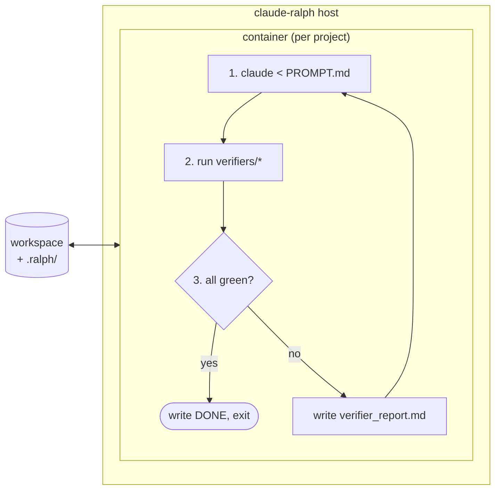

# claude-ralph

A containerized [ralph loop](https://ghuntley.com/ralph/) for Claude Code, with **pluggable, externally-verified success criteria**. Drop in a spec, drop in a verifier, run `claude-ralph up`, walk away.

> **What's a ralph loop?** `while :; do cat PROMPT.md | claude-code; done`, basically. You hand the agent a goal and a punch list, it iterates, you watch. The hard part isn't the loop — it's knowing when to stop and what "done" actually means. See Huntley's [original](https://ghuntley.com/loop/) and [follow-up](https://ghuntley.com/ralph/).

## Why this exists

The canonical ralph loop has two weaknesses:

1. **It runs on your laptop.** `rm -rf` is one bad iteration away. People work around this with `--dangerously-skip-permissions`, white-knuckled. We just put it in a container.
2. **"Done" is whatever the LLM says it is.** The model writes `DONE` to a sentinel file when it *thinks* it's done. That's a hallucination away from a green light on red code. We replace self-report with **external verifiers** — exit-code-driven scripts that run after every iteration and gate the loop.

That second point is the whole pitch. The agent doesn't decide it's done; your test suite does. Or your typechecker. Or a Playwright script. Or Chrome DevTools MCP eyeballing the rendered page. Or all four.

## How it works



Each iteration:

1. Compose a prompt from `PROMPT.md` + `specs/` + `fix_plan.md` + the previous iteration's `verifier_report.md`.
2. Pipe it to `claude` inside the container. The agent edits files, runs commands, updates `fix_plan.md`.
3. Run every executable in `.ralph/verifiers/` in lexical order. Capture stdout/stderr and exit codes.
4. **All exit 0** → write `.ralph/DONE`, stop the loop, you get a notification. **Anything nonzero** → write a fresh `verifier_report.md` summarizing failures, loop.

The verifier report is the feedback signal. The agent reads it next iteration and reacts.

## Install

```bash
git clone https://github.com/nbarlow/claude-ralphs ~/code/claude-ralph
cd ~/code/claude-ralph
make install                # symlinks `claude-ralph` into ~/.local/bin
```

Requires: Docker (or Podman), `bash`, `make`. The container image is built on first `claude-ralph up` and cached.

## Quick start

In any project:

```bash
claude-ralph init           # scaffolds .ralph/ — PROMPT.md, specs/, verifiers/, fix_plan.md
$EDITOR .ralph/PROMPT.md    # state the goal
$EDITOR .ralph/specs/001-*.md
chmod +x .ralph/verifiers/01-tests.sh   # already scaffolded; edit to taste
claude-ralph up             # build container, start looping
```

In another terminal:

```bash
claude-ralph logs -f        # follow what the agent is doing
claude-ralph status         # iteration count, last verifier results, est. token spend
claude-ralph stop           # graceful: finish current iteration then exit
claude-ralph kill           # ungraceful: SIGTERM the container now
```

## The `.ralph/` layout

| path | written by | purpose |
|---|---|---|
| `PROMPT.md` | you | The prompt fed to claude every iteration. Tune it. |
| `AGENT.md` | agent | How-to-build, how-to-run, learnings. Agent appends. |
| `fix_plan.md` | agent | Prioritized punch list. Agent maintains. |
| `specs/NNN-*.md` | you | What to build. One file per slice. |
| `verifiers/NN-*.sh` | you | Success criteria. Exit 0 = pass. Lexical run order. |
| `verifier_report.md` | ralph | Last run's results. Read by the agent next iteration. |
| `iterations/NNNN/` | ralph | Full history per iteration: `prompt.txt`, `stdout.log`, `stderr.log`, `verifiers.json`. |
| `config.toml` | you | Loop / container / claude knobs. Optional. |
| `DONE` | ralph | Sentinel — written when all verifiers pass. Loop exits. |

## Verifiers: the plugin contract

**The contract is exit code + stdout.** That's it. No YAML, no plugin registry, no DSL.

A verifier is any executable in `.ralph/verifiers/`. It:

- Runs from the workspace root, inside the container.
- Exits **0** if its criterion is satisfied, **nonzero** otherwise.
- Writes human-readable diagnostic output to stdout/stderr — this gets fed back to the agent.

Naming: lexical order = run order. Use `NN-name` (`01-tests.sh`, `02-lint.sh`) so you control sequencing.

### Examples

**Tests pass:**

```bash
#!/usr/bin/env bash
# .ralph/verifiers/01-tests.sh
set -euo pipefail
npm test
```

**Typecheck clean:**

```bash
#!/usr/bin/env bash
# .ralph/verifiers/02-typecheck.sh
set -euo pipefail
npx tsc --noEmit
```

**Visual check via Chrome DevTools MCP:**

```bash
#!/usr/bin/env bash
# .ralph/verifiers/03-rendered-ok.sh
# Spawns the dev server, asks claude (one-shot, no loop) to load the page
# via chrome-devtools-mcp and report whether the feature looks right.
# Exits 0 if claude reports OK.
set -euo pipefail
npm run dev &>/dev/null &
SERVER_PID=$!
trap "kill $SERVER_PID" EXIT

claude --print --mcp-config .ralph/mcp/chrome.json <<'EOF' | grep -q '^OK$'
Load http://localhost:3000/checkout. The "Apply coupon" button should be visible
and enabled. Print exactly "OK" if so, otherwise print "FAIL: <reason>".
EOF
```

**Grafana SLO not regressed:**

```bash
#!/usr/bin/env bash
# .ralph/verifiers/04-slo.sh
set -euo pipefail
ERR_RATE=$(curl -sf "https://grafana.internal/api/.../checkout-error-rate" | jq -r '.data')
awk -v r="$ERR_RATE" 'BEGIN { exit (r < 0.01) ? 0 : 1 }'
```

### Optional metadata

A header comment block lets ralph render nicer reports and treat some verifiers as advisory:

```bash
#!/usr/bin/env bash
# ralph: name = "frontend tests"
# ralph: blocking = false              # default true; false = report but don't gate DONE
# ralph: timeout = 5m                  # default unlimited
# ralph: rerun-on-failure = 3          # flake tolerance
```

This is parsed best-effort. No metadata is also fine — the contract is still just exit code.

## Configuration

`.ralph/config.toml` (all fields optional):

```toml
[loop]
max_iterations = 50          # hard stop. default 50. --unlimited overrides.
max_cost_usd = 25.00         # halts loop when accumulated API spend exceeds.
on_done = "notify"           # "notify" | "shutdown" | "open-pr"

[container]
image = "claude-ralph:latest"   # override with your own Dockerfile
extra_mounts = ["~/.gitconfig:/root/.gitconfig:ro"]
env_passthrough = ["GITHUB_TOKEN", "OPENAI_API_KEY"]

[claude]
model = "claude-opus-4-7"
allowed_tools = ["Bash", "Edit", "Write", "Read"]   # passed to claude
mcp_config = ".ralph/mcp.json"
```

## Container

Default image: bash, git, node, python, ripgrep, jq, the `claude` CLI, and Playwright with Chromium. Workspace is bind-mounted at `/workspace`. `ANTHROPIC_API_KEY` passes through from the host.

Override by dropping a `.ralph/Dockerfile` in your project — `claude-ralph up` will detect and use it. `FROM claude-ralph:base` to extend.

## Subcommands

| command | does |
|---|---|
| `init` | scaffold `.ralph/` |
| `up` | build container, start loop, attach |
| `up -d` | same, detached |
| `logs [-f]` | tail the running loop |
| `status` | iteration count, last verifier results, token spend |
| `verify` | run verifiers once against current state, no loop |
| `step` | run one iteration, then stop |
| `stop` | graceful stop after current iteration |
| `kill` | SIGTERM now |
| `clean` | remove `.ralph/iterations/` and `DONE` |
| `shell` | exec a bash shell into the container for debugging |

## Tuning the prompt

The default `PROMPT.md` follows Huntley's structure: study the specs, work the punch list one item at a time, update `fix_plan.md`, append learnings to `AGENT.md`. **Don't expect to leave it alone.** Watch the first few iterations and tune.

> "There is no such thing as a perfect prompt." — Huntley

## What's deliberately *not* in scope

- **No GUI / web dashboard.** `logs -f` and a tmux pane are enough.
- **No remote orchestration.** This runs one loop on one host against one repo. If you want a fleet, wrap it.
- **No model-agnostic abstraction.** This is for Claude Code. The loop pattern is universal but the prompt format and tool wiring aren't.
- **No verifier marketplace.** They're 10 lines of bash. Write yours.

## Open design questions

These are flagged for discussion before/during implementation, not decided:

1. **Verifier flake handling.** `rerun-on-failure = N` in metadata is a starting point but real flakes need more — quarantine? per-verifier success-rate tracking? Or punt and tell users to fix their flakes.
2. **Cost accounting.** `claude` CLI doesn't (yet?) expose per-call token counts in a stable way. We may need to scrape stderr or make users set `max_iterations` and call it a day.
3. **Auto-spec generation.** Exokomodo's ralph splits a flat task file into specs via a one-shot LLM call. Useful, but it's another place hallucinations enter. Default off; opt in via `claude-ralph plan`.
4. **Branch / PR workflow.** Should `on_done = "open-pr"` be first-class? Or keep ralph dumb and let users wire it via a final verifier that does the push?
5. **Multiple loops, one repo.** `.ralph/` per worktree is probably the answer, but worth confirming.

## Prior art

- [ghuntley/loop](https://ghuntley.com/loop/) — the original technique.
- [exokomodo/im-gonna-ralph](https://github.com/exokomodo/im-gonna-ralph) — bash implementation atop GitHub Copilot CLI, with iteration history and SDD spec splitting. We borrow the iteration-dir pattern.
- This project differs by: (a) Claude Code instead of Copilot, (b) container-first, (c) external verifier gating instead of self-report DONE.

## License

See [LICENSE](LICENSE).
